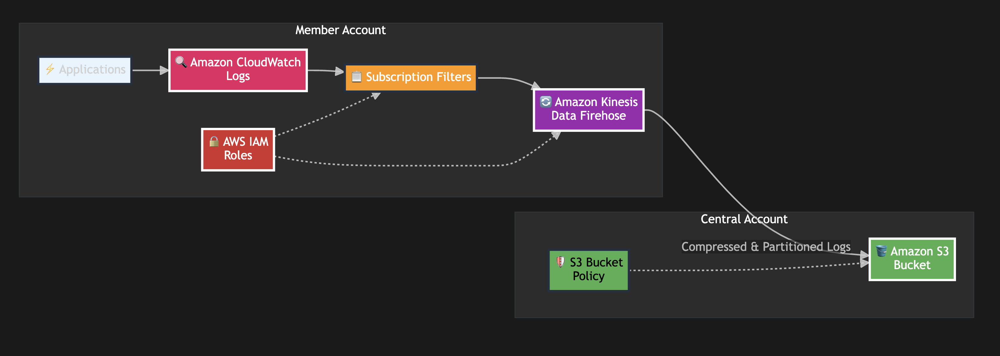

# CloudWatch Logs Cross-Account Export (AWS Console)

This guide provides a complete manual setup using the AWS Console for CloudWatch logs cross-account export.

## 🏗️ Architecture Overview

This solution enables seamless cross-account log aggregation with the following benefits:

- ✅ **Centralized Logging**: Aggregate logs from multiple member accounts into a single central S3 bucket
- ✅ **Cost Optimized**: GZIP compression reduces storage costs by 60-70%
- ✅ **Secure**: Cross-account access with least privilege IAM policies
- ✅ **Scalable**: Time-based partitioning for efficient querying
- ✅ **Automated**: One-click setup with comprehensive validation

<div align="center">
  
</div>

## 📊 Resources Overview

This setup creates resources across two AWS accounts:

### 🏠 Source Account (Where Your Logs Originate)
**Resources Created:**
- **2 IAM Roles:**
  - `your-firehose-role-name` - Allows Firehose to write to S3
  - `your-cloudwatch-logs-role-name` - Allows CloudWatch to send logs to Firehose
- **2 IAM Policies:**
  - `your-firehose-policy-name` - S3 write permissions
  - `your-cloudwatch-logs-policy-name` - Firehose put permissions
- **1 Kinesis Data Firehose Stream:**
  - `your-firehose-delivery-stream-name` - Processes and delivers logs to S3
- **1 CloudWatch Log Group:** *(Auto-created)*
  - `/aws/kinesisfirehose/your-firehose-delivery-stream-name` - Firehose monitoring logs
- **1 CloudWatch Logs Destination:** *(CLI Only)*
  - `your-logs-destination-name` - Cross-account log destination
- **Subscription Filters:** *(Added to existing log groups)*
  - Added to your existing application log groups - Routes logs to the destination

### 🏢 Destination Account (Where Logs Are Stored)
**Resources Created:**
- **1 S3 Bucket:**
  - `{ACCOUNT_NAME}-logs-bucket` - Stores all exported logs
  - Versioning enabled for data protection
  - Cross-account bucket policy for source account access

### 💰 Cost Estimate
- **Firehose:** ~$0.029 per GB processed
- **S3 Storage:** ~$0.023 per GB/month (Standard)
- **CloudWatch Logs:** ~$0.50 per GB ingested
- **Data Transfer:** Free between AWS accounts in same region

### ⚠️ Important Console Limitations
- **Cross-Account S3 Bucket:** Console validation fails for cross-account buckets, even with proper permissions - requires AWS CLI
- **Firehose Stream Creation:** For cross-account S3 destinations, use AWS CLI instead of Console (Step 7)
- **CloudWatch Logs Destinations:** Cannot be created via Console - requires AWS CLI (Steps 8-9)
- **Log Groups:** Firehose automatically creates monitoring log groups when error logging is enabled

## ⚠️ IMPORTANT: Replace Placeholders Before Use

**Before using any policies or configurations below, replace these placeholders with your actual values:**

| Placeholder | Replace With | Example |
|-------------|--------------|---------|
| `{MEMBER_ACCOUNT_ID}` | Your Member Account ID | `123456789012` |
| `{CENTRAL_ACCOUNT_ID}` | Your Central Account ID | `987654321098` |
| `{ACCOUNT_NAME}` | Your Organization/Prefix Name | `myaccount` |
| `{AWS_REGION}` | Your AWS Region | `us-east-1` |

## 📋 Prerequisites

- Access to both member and central AWS accounts
- IAM permissions to create roles, policies, S3 buckets, and Firehose resources
- AWS CLI installed (only for steps that require CLI)

## 🚀 Sequential Setup Instructions

### Phase 1: Member Account IAM Setup

**🔄 Switch to your Member Account in AWS Console**

#### Step 1: Create Firehose IAM Role

1. Navigate to **IAM Console** → **Roles** → **Create Role**
2. Select **AWS Service** → **Kinesis** → **Kinesis Data Firehose**
3. Click **Next: Permissions**
4. Skip permissions for now, click **Next: Tags**
5. Add tags (optional), click **Next: Review**
6. **Role name:** `your-firehose-role-name`
7. **Description:** `Role for Firehose to write logs to S3 bucket`
8. Click **Create Role**

#### Step 2: Create and Attach Firehose S3 Policy

1. In **IAM Console** → **Policies** → **Create Policy**
2. Click **JSON** tab and paste:

> **📝 NOTE:** Replace `your-s3-bucket-name` with the actual name of your S3 bucket (e.g., `mycompany-logs-bucket`)

```json
{
  "Version": "2012-10-17",
  "Statement": [
    {
      "Effect": "Allow",
      "Action": [
        "s3:AbortMultipartUpload",
        "s3:GetBucketLocation",
        "s3:GetObject",
        "s3:ListBucket",
        "s3:ListBucketMultipartUploads",
        "s3:PutObject",
        "s3:PutObjectAcl"
      ],
      "Resource": [
        "arn:aws:s3:::your-s3-bucket-name",
        "arn:aws:s3:::your-s3-bucket-name/*"
      ]
    },
    {
      "Effect": "Allow",
      "Action": [
        "logs:PutLogEvents"
      ],
      "Resource": "*"
    }
  ]
}
```

3. Click **Next: Tags** → **Next: Review**
4. **Name:** `your-firehose-policy-name`
5. **Description:** `Allows Firehose to write to S3 bucket`
6. Click **Create Policy**

**Attach Policy to Role:**
1. Go to **IAM** → **Roles** → Find `your-firehose-role-name`
2. Click **Attach Policies**
3. Search and select `your-firehose-policy-name`
4. Click **Attach Policy**

#### Step 3: Create CloudWatch Logs IAM Role

1. Navigate to **IAM Console** → **Roles** → **Create Role**
2. Select **Custom Trust Policy**
3. Paste this trust policy:

```json
{
  "Version": "2012-10-17",
  "Statement": [
    {
      "Effect": "Allow",
      "Principal": {
        "Service": "logs.{AWS_REGION}.amazonaws.com"
      },
      "Action": "sts:AssumeRole"
    }
  ]
}
```

4. Click **Next**
5. Skip permissions for now, click **Next**
6. Add tags (optional), click **Next**
7. **Role name:** `your-cloudwatch-logs-role-name`
8. **Description:** `Role for CloudWatch Logs to send data to Firehose`
9. Click **Create Role**

#### Step 4: Create and Attach CloudWatch Logs Policy

1. In **IAM Console** → **Policies** → **Create Policy**
2. Click **JSON** tab and paste:

> **📝 NOTE:** Replace `your-firehose-delivery-stream-name` with the actual name of your Firehose stream (e.g., `mycompany-logs-stream`)

```json
{
  "Version": "2012-10-17",
  "Statement": [
    {
      "Effect": "Allow",
      "Action": [
        "firehose:PutRecord",
        "firehose:PutRecordBatch"
      ],
      "Resource": "arn:aws:firehose:{AWS_REGION}:{MEMBER_ACCOUNT_ID}:deliverystream/your-firehose-delivery-stream-name"
    }
  ]
}
```

3. Click **Next: Tags** → **Next: Review**
4. **Name:** `your-cloudwatch-logs-policy-name`
5. **Description:** `Allows CloudWatch Logs to send data to Firehose stream`
6. Click **Create Policy**

**Attach Policy to Role:**
1. Go to **IAM** → **Roles** → Find `your-cloudwatch-logs-role-name`
2. Click **Attach Policies**
3. Search and select `your-cloudwatch-logs-policy-name`
4. Click **Attach Policy**

### Phase 2: Central Account S3 Setup

**🔄 Switch to your Central Account in AWS Console**

#### Step 5: Create S3 Bucket

1. Navigate to **S3 Console** → **Create Bucket**
2. **Bucket name:** `your-s3-bucket-name` (e.g., `mycompany-logs-bucket`)
3. **Region:** `{AWS_REGION}`
4. Keep default settings for **Object Ownership** and **Public Access**
5. Under **Bucket Versioning** → Select **Enable**
6. Keep default settings for **Encryption** and **Advanced**
7. Click **Create Bucket**

#### Step 6: Apply Cross-Account Bucket Policy

1. Click on your created bucket: `your-s3-bucket-name`
2. Go to **Permissions** tab
3. Scroll down to **Bucket Policy** → Click **Edit**
4. Paste this policy:

> **📝 NOTE:** Replace with your actual values:
> - `your-firehose-role-name`: The name of your Firehose IAM role (e.g., `mycompany-firehose-role`)
> - `your-s3-bucket-name`: The name of this S3 bucket (e.g., `mycompany-logs-bucket`)

```json
{
  "Version": "2012-10-17",
  "Statement": [
    {
      "Sid": "AllowFirehoseFromMemberAccount",
      "Effect": "Allow",
      "Principal": {
        "AWS": "arn:aws:iam::{MEMBER_ACCOUNT_ID}:role/your-firehose-role-name"
      },
      "Action": [
        "s3:AbortMultipartUpload",
        "s3:GetBucketLocation",
        "s3:GetObject",
        "s3:ListBucket",
        "s3:ListBucketMultipartUploads",
        "s3:PutObject",
        "s3:PutObjectAcl"
      ],
      "Resource": [
        "arn:aws:s3:::your-s3-bucket-name",
        "arn:aws:s3:::your-s3-bucket-name/*"
      ]
    },
    {
      "Sid": "DenyInsecureConnections",
      "Effect": "Deny",
      "Principal": "*",
      "Action": "s3:*",
      "Resource": [
        "arn:aws:s3:::your-s3-bucket-name",
        "arn:aws:s3:::your-s3-bucket-name/*"
      ],
      "Condition": {
        "Bool": {
          "aws:SecureTransport": "false"
        }
      }
    }
  ]
}
```

5. Click **Save Changes**

### Phase 3: Member Account Log Pipeline Setup

**🔄 Switch back to your Member Account in AWS Console**

#### Step 7: Create Firehose Delivery Stream

**⚠️ AWS CLI Required for Cross-Account S3 Buckets**

The AWS Console has validation issues with cross-account S3 buckets. Use the CLI command below instead:

> **📝 NOTE:** Replace the following values in the command:
> - `your-firehose-delivery-stream-name`: Name for your Firehose stream (e.g., `mycompany-logs-stream`)
> - `your-firehose-role-name`: Name of your Firehose IAM role (e.g., `mycompany-firehose-role`)
> - `your-s3-bucket-name`: Name of your S3 bucket (e.g., `mycompany-logs-bucket`)
> - `{AWS_REGION}`: Your AWS region (e.g., `us-east-1`, `eu-west-1`)

```bash
aws firehose create-delivery-stream \
  --delivery-stream-name "your-firehose-delivery-stream-name" \
  --s3-destination-configuration '{
    "RoleARN": "arn:aws:iam::{MEMBER_ACCOUNT_ID}:role/your-firehose-role-name",
    "BucketARN": "arn:aws:s3:::your-s3-bucket-name",
    "Prefix": "cloudwatch-logs/year=!{timestamp:yyyy}/month=!{timestamp:MM}/day=!{timestamp:dd}/hour=!{timestamp:HH}/",
    "ErrorOutputPrefix": "cloudwatch-logs-errors/",
    "BufferingHints": {
      "SizeInMBs": 5,
      "IntervalInSeconds": 300
    },
    "CompressionFormat": "GZIP",
    "CloudWatchLoggingOptions": {
      "Enabled": true,
      "LogGroupName": "/aws/kinesisfirehose/your-firehose-delivery-stream-name",
      "LogStreamName": "S3Delivery"
    }
  }' \
  --region {AWS_REGION}
```

**Verify Creation:**
```bash
aws firehose describe-delivery-stream \
  --delivery-stream-name "your-firehose-delivery-stream-name" \
  --region {AWS_REGION}
```

> **💡 Why CLI?** AWS Console validation fails when trying to access cross-account S3 buckets, even with proper bucket policies. The CLI works reliably because it doesn't perform the same upfront validation.

#### Step 8: Create CloudWatch Logs Destination

**⚠️ AWS CLI Required - Cannot be done via Console**

This step requires AWS CLI as CloudWatch Logs destinations are not available in the Console UI:

> **📝 NOTE:** Replace with your actual values:
> - `your-logs-destination-name`: Name for your destination (e.g., `mycompany-logs-destination`)
> - `your-firehose-delivery-stream-name`: Your Firehose stream name (e.g., `mycompany-logs-stream`)
> - `your-cloudwatch-logs-role-name`: Your CloudWatch Logs role name (e.g., `mycompany-cloudwatch-logs-role`)

```bash
aws logs put-destination \
  --destination-name "your-logs-destination-name" \
  --target-arn "arn:aws:firehose:{AWS_REGION}:{MEMBER_ACCOUNT_ID}:deliverystream/your-firehose-delivery-stream-name" \
  --role-arn "arn:aws:iam::{MEMBER_ACCOUNT_ID}:role/your-cloudwatch-logs-role-name" \
  --region {AWS_REGION}
```

#### Step 9: Set Destination Policy

**⚠️ AWS CLI Required - Cannot be done via Console**

> **📝 NOTE:** Replace `your-logs-destination-name` with your actual destination name (e.g., `mycompany-logs-destination`)

```bash
aws logs put-destination-policy \
  --destination-name "your-logs-destination-name" \
  --access-policy '{
    "Version": "2012-10-17",
    "Statement": [
      {
        "Sid": "AllowPutSubscriptionFilter",
        "Effect": "Allow",
        "Principal": {
          "AWS": "{MEMBER_ACCOUNT_ID}"
        },
        "Action": "logs:PutSubscriptionFilter",
        "Resource": "arn:aws:logs:{AWS_REGION}:{MEMBER_ACCOUNT_ID}:destination:your-logs-destination-name"
      }
    ]
  }' \
  --region {AWS_REGION}
```

#### Step 10: Add Subscription Filter to Existing Log Group

**⚠️ Prerequisites:** Your application should already be writing logs to CloudWatch Log Groups.

**Get Your Destination ARN:**

First, get the ARN of the destination you just created:

```bash
aws logs describe-destinations --destination-name-prefix "your-logs-destination-name" --region {AWS_REGION} --query 'destinations[0].arn' --output text
```

**Create Subscription Filter via AWS Console:**

**Via AWS Console:**
1. Navigate to **CloudWatch Console** → **Log Groups**
2. **Find your existing application log group** (the one your application writes to)
3. **Click on the log group name** to open it
4. Go to **Subscription Filters** tab
5. Click **Create Amazon Data Firehose Subscription Filter**
6. **Choose Destination:** Select **Cross-Account**
7. **Destination ARN:** Paste the ARN from the command above
8. **Subscription filter name:** `your-subscription-filter-name` (e.g., `mycompany-logs-export`)
9. **Filter pattern:** Leave empty (exports all logs) or use a pattern to filter specific logs
10. Click **Create Subscription Filter**

> **💡 Tip:** You can create subscription filters for multiple log groups by repeating steps 2-10 for each log group you want to export.

**Via AWS CLI (Alternative if Console fails):**

> **📝 NOTE:** Replace with your actual values:
> - `your-application-log-group-name`: Your application log group name
> - `your-subscription-filter-name`: Name for your subscription filter
> - `your-logs-destination-name`: Name of your CloudWatch Logs destination

```bash
aws logs put-subscription-filter \
  --log-group-name "your-application-log-group-name" \
  --filter-name "your-subscription-filter-name" \
  --filter-pattern "" \
  --destination-arn "arn:aws:logs:{AWS_REGION}:{MEMBER_ACCOUNT_ID}:destination:your-logs-destination-name" \
  --region {AWS_REGION}
```

## 🧪 Testing Your Setup

### Option 1: Use Your Existing Application Logs
The best test is to let your application generate logs naturally. The subscription filter will automatically export new logs to S3.

### Option 2: Send Test Log via CLI
If you want to send a specific test message:

```bash
# Replace with your actual log group name
aws logs put-log-events \
  --log-group-name "your-existing-log-group-name" \
  --log-stream-name "test-stream-$(date +%s)" \
  --log-events timestamp=$(date +%s)000,message="Test log message for cross-account export - $(date)" \
  --region {AWS_REGION}
```

### Option 3: Send Test Log via Console:
1. Navigate to **CloudWatch Console** → **Log Groups**
2. Click on your **existing application log group**
3. Create a new log stream or use an existing one
4. **Upload Log Events** with a test message

**Expected Result:** Logs should appear in your S3 bucket within 5-15 minutes at:
```
s3://your-s3-bucket-name/cloudwatch-logs/year=YYYY/month=MM/day=DD/hour=HH/
```

> **💡 Note:** It may take 5-15 minutes for logs to appear in S3 due to Firehose buffering. Check both successful delivery and any error logs in the Firehose monitoring log group.

## 🔍 Validation via Console

### Check IAM Roles:
1. **IAM Console** → **Roles** → Verify these exist:
   - `your-firehose-role-name`
   - `your-cloudwatch-logs-role-name`

### Check S3 Bucket:
1. **S3 Console** → Verify bucket exists: `your-s3-bucket-name`
2. Check **Permissions** → **Bucket Policy** is applied

### Check Firehose Stream:
1. **Kinesis Console** → **Data Firehose** → Verify:
   - Stream: `your-firehose-delivery-stream-name`
   - Status: **Active**

### Check CloudWatch Resources:
1. **CloudWatch Console** → **Log Groups** → Verify:
   - Your existing application log groups have subscription filters
   - `/aws/kinesisfirehose/your-firehose-delivery-stream-name` (monitoring logs)

### Check Subscription Filter:
1. Click on your **application log group**
2. **Subscription Filters** tab → Verify filter exists and points to your destination

## ⚠️ AWS CLI Required Steps

The following steps **cannot be done via AWS Console** and require AWS CLI:
- **Step 7:** Creating Firehose Delivery Stream (cross-account S3 bucket validation issue)
- **Step 8:** Creating CloudWatch Logs Destination
- **Step 9:** Setting Destination Policy

Make sure you have AWS CLI installed and configured for these steps.

## 📝 Summary of Resources Created

### Member Account:
- **IAM Roles:**
  - `your-firehose-role-name` - Allows Firehose to write to S3
  - `your-cloudwatch-logs-role-name` - Allows CloudWatch Logs to send to Firehose
- **IAM Policies:**
  - `your-firehose-policy-name` - S3 write permissions
  - `your-cloudwatch-logs-policy-name` - Firehose put permissions
- **Firehose Stream:** `your-firehose-delivery-stream-name`
- **CloudWatch Resources:**
  - Log Group: `your-application-log-group-name` (your app logs)
  - Log Group: `/aws/kinesisfirehose/your-firehose-delivery-stream-name` (monitoring)
  - Destination: `your-logs-destination-name` *(CLI only)*
  - Subscription Filter: `your-subscription-filter-name`

### Central Account:
- **S3 Bucket:** `your-s3-bucket-name` with cross-account policy

## 🎯 Quick Checklist

- [ ] Replace all 4 placeholders with your values
- [ ] Complete Phase 1 in Member Account (IAM setup)
- [ ] Complete Phase 2 in Central Account (S3 setup)  
- [ ] Complete Phase 3 in Member Account (Pipeline setup)
- [ ] Run AWS CLI commands for Steps 9-10 (destination setup)
- [ ] Test log export and verify logs appear in S3

---

**Need help?** Check the main repository documentation for detailed troubleshooting and architecture information.
